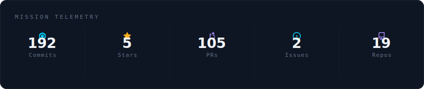

# 👋 Olá! Eu sou o Cauã Vargas

🎯 **Desenvolvedor Back-end Júnior**  
💻 **Java | Spring Boot | AWS | Node.js**  
☁️ **AWS Certified Cloud Practitioner**

---

##  Sobre mim

Olá! Meu nome é **Cauã Vargas**, tenho **18 anos** e sou um **Desenvolvedor Back-end Júnior**, apaixonado por tecnologia e em constante evolução.

Iniciei minha jornada na programação em **2022** e, desde então, venho me especializando em **desenvolvimento web**, **serviços back-end** e **soluções escaláveis**.  
Sou formado como **Técnico em Informática para Internet** pela **QI Faculdade & Escola Técnica**, onde obtive as **melhores notas da turma**.

Também tive a oportunidade de atuar como **estagiário em uma multinacional de tecnologia**, trabalhando em projetos reais, adquirindo experiência prática e desenvolvendo habilidades técnicas e profissionais importantes.

Atuo principalmente com **Java e Spring Boot**, mas também possuo experiência com tecnologias do ecossistema **web e cloud**, incluindo **AWS, React, Next.js, NestJS, MongoDB, MySQL e Tailwind CSS**.

Sou uma pessoa **motivada, curiosa e comprometida**, com grande disposição para aprender e evoluir. Prezo por **código limpo, funcional, otimizado e bem estruturado**, sempre buscando entregar soluções de qualidade e gerar impacto real nos projetos.

---

## 🏆 Certificações

- ☁️ **AWS Certified Cloud Practitioner**
- 🤖 **Al-Assisted Certified Professional**
- 🤖 **Gen Al Technical Certification**
- 🎓**PARTICIPAÇÃO NO SCHOLARSHIP PROGRAM**
---

## 📫 Contato

  <a href="mailto:cauavargas1849@gmail.com">cauavargas1849@gmail.com</a>

---

## 💻 Tech Stack

  

---

## 📊 GitHub Stats

  
  

    
  

  
   
  
  

    
  

  
   
  
  

    
  

---

 ⚙️ *Aberto para freelances, vagas júnior, estágios e projetos envolvendo Java, Spring Boot, APIs REST e cloud (AWS).*
